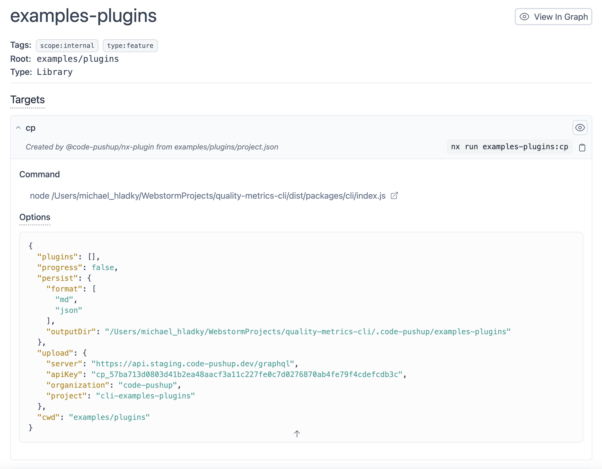
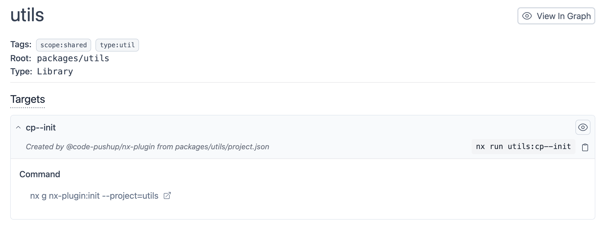

# @code-pushup/nx-plugin

## Register the plugin

In your `nx.json` under the root property add `plugins` add `@code-pushup/nx-plugin`:

```json
{
  "plugin": ["@code-pushup/nx-plugin"]
}
```

**This enables different dynamic targets on your projects:**

- ✅ target `code-pushup` if `code-pushup.condif.ts` is present in root - equal to execute `npx code-pushup` with nx defaults.  
  
- ✅ target `code-pushup--init` if `code-pushup.condif.ts` is NOT present in root - equal to execute `npx g @code-pushup/nx-plugin:init` with nx defaults
  

Try it out by executing the following commands:

- `nx run <project-without-config>:code-pushup` - adds `code-pushup.config.ts` to your project root
- `nx run <project-without-config>:code-pushup` - adds `code-pushup.config.ts` to your project root
- `nx run <project-with-config>:code-pushup` - runs `npx code-pushup` to your project root
- `nx run <project-with-config>:code-pushup` - runs `npx code-pushup` to your project root
- `nx show project <project>`- logs JSON string of project config to terminal
- `nx show project --web <project>`- opens browser with beautiful UI showing the project configuration

## Target Default

Set workspace specific target defaults in your `nx.json`:

```json
{
  "targetDefaults": {
    "code-pushup": {
      "dependsOn": [
        {
          "projects": ["test-setup"],
          "target": "test-coverage",
          "projectPrefix": "org"
        }
      ]
    }
  }
}
```

## Plugin Options

To configure the plugin globally use the plugin options.

**Options:**

- `targetName` - changes all target names. "code-pushup" to "cp" and "code-pushup--init" to "cp--init"

```json
{
  "plugin": [
    {
      "plugin": "@code-pushup/nx-plugin",
      "options": {
        "targetName": "cp"
      }
    }
  ]
}
```

Try it out by executing the following commands:

```bash
nx run <project-without-config>:cp
nx run cp
nx cp
```

- `projectPrefix` - adds a prefix to all projects but root. "<project>" to "cp-<project>"

```json
{
  "plugin": [
    {
      "plugin": "@code-pushup/nx-plugin",
      "options": {
        "projectPrefix": "cp"
      }
    }
  ]
}
```

<!--
- `plugins` - registry for global plugins.

```json
{
  "plugin": [
    {
      "plugin": "@code-pushup/nx-plugin",
      "options": {
        "plugins": [
          "node_modules/@code-pushup/eslint-plugin/index.js",
          "@code-pushup/eslint-plugin",
          {
            "plugin": "@code-pushup/eslint-plugin"
          },
          {
            "plugin": "@code-pushup/eslint-plugin",
            "options": {}
          }
        ]
      }
    }
  ]
}
```
-->
